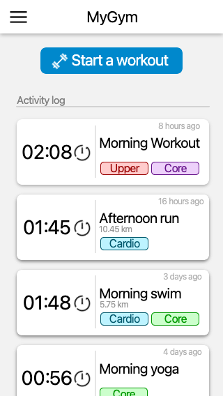

# README

**MyGym** is a personal project where I develop a functional application for
exercise session journaling, with no cloud nor backend present, fully local.

The idea is that this app is fully functional: it records the session, it shows
an activity log, and it compares some of your sessions or exercises.

## The Application

The technology choosen is flutter. Flutter allows to build cross-platform applications
in a way of "agnostic" engine. The code is encased in the `my_gym` folder. Why?
Well, because I forgot that the flutter tool will create the project folder.
Maybe in a future I decide to move the folder.

### Styling

The application tries to follow the standrad design in Cupertino (iOS) and
Material (google/android). The idea is to use the already present widgets so the
design is set to minimal. Nevertheless, the idea is to follow an schema that
is similar to:

Yes the image looks awful and small and pixelated, to be honest, I don't know why.
I don't know how to use good mockup applications, as I have 0 experience and 
design sense. Basically, Lunacy was behaving strangely and the processing was not
good.

## Roadmap

Right now I am focusing on developing the functional application "so it works"
right away. Nevertheless, the project is set up so that it can be built or 
customized for "iOS" and "android" exclusively.

Here is a kind of TODO (or task list):

#### Shared

- [ ] Data Model.
- [ ] Data Serialization and Local Storage.
- [ ] Exercise Model.
- [ ] Testing List. 
- [ ] Profiling.

#### iOS

- [ ] Splash Screen.
- [ ] Home screen.
- [ ] Card for Session.
- [ ] Session Details screen.
- [ ] Session Recording screen.
- [ ] Divider use Swift Native library (??? can it be used? otherwise refactor it)

#### Android

- [ ] Splash Screen.
- [ ] Home screen.
- [ ] Card for Session.
- [ ] Session Details screen.
- [ ] Session Recording screen.

#### Features

Well, I am open to any suggestion, but it has to remain barebones and should not
be overcomplicated. Some suggested extra features from my close circle include 
a kind of reminder that you can set for the next session that you do on a certain
exercise, as a form of warning to watch for the form or the weight or whatever.

If you want to suggest features, maybe it should be done through github issues?

Anyways, thanks for taking a look at the application.

